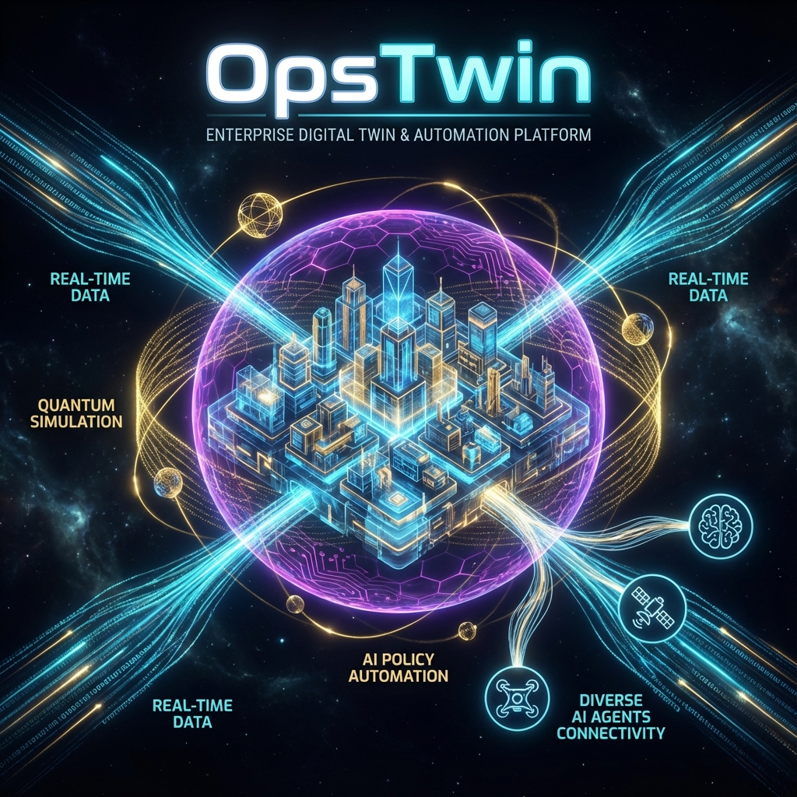
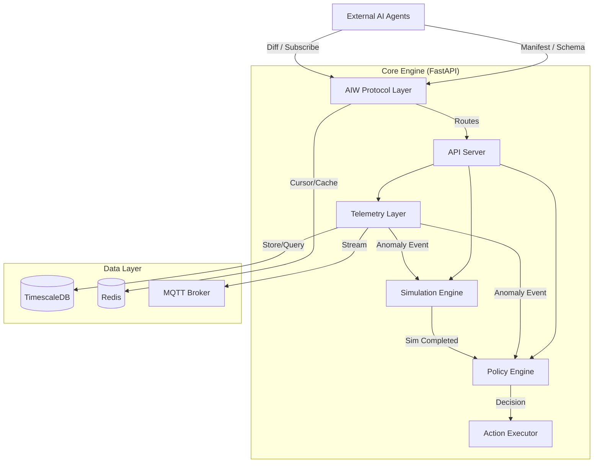

# OpsTwin: AI-Native Operational Optimization Platform




**OpsTwin.aiw** is an **Operational Optimization Execution Platform** that builds a **Digital Twin** from *real-time telemetry*, performs **simulation-based (classical+quantum) decision making**, automates **Propose/Approve/Execute** workflows according to **Policy**, and allows external AI agents to continuously synchronize all changes via **AIW (AI Web) Protocol**.

---

## 🚀 Why OpsTwin?

### The Problem

* **Latency**: Data is real-time, but decisions are delayed by human analysis and meetings.
* **Risk**: High-impact changes (parameter tuning, resource allocation) are hard to automate safely.
* **Opacity**: "Why" a decision was made is often lost in human communication.

### The Solution: AIW Protocol

OpsTwin replaces the "Human-Reading Web" with the **AIW (AI Web) Protocol**:

1. **Manifest**: Self-describing service capabilities.
2. **Schema-First**: Machine-readable JSON Schemas (not just docs).
3. **Diff/Stream**: Delta synchronization instead of full-page loads.
4. **Policy-First**: Rules and permissions are code, ensuring safe automation.

---

## 🏗️ Architecture

OpsTwin consists of 6 core layers integrating Real-time Telemetry, Simulation, and Policy.



---

## ⚡ Quick Start

### 1. Installation

```bash
# Clone the repository
git clone https://github.com/sadpig70/AI_Web.git
cd AI_Web

# Install dependencies
pip install -e ".[dev]"
```

### 2. Run Server

```bash
uvicorn src.api.main:app --reload --port 8000
```

* **API Docs**: <http://localhost:8000/docs>
* **Manifest**: <http://localhost:8000/.well-known/aiw-manifest.json>

### 3. Run with Docker

```bash
cd docker
docker-compose up -d
```

Services started:

* **API Server**: <http://localhost:8000>
* **Redis**: Port 6379
* **TimescaleDB**: Port 5432

---

## 📚 Documentation

Detailed documentation is available in the `docs/` directory:

* **Concepts**
  * [What is OpsTwin?](docs/concepts/what-is-opstwin.md) - Core values and use cases.
  * [Architecture](docs/concepts/architecture.md) - Detailed system design.
  * [Glossary](docs/concepts/glossary.md) - Terms like AIW, Twin, Policy.
* **Getting Started**
  * [Quick Start](docs/getting-started/quick-start.md) - Step-by-step guide.
* **Specifications**
  * [Technical Spec v0.3](docs/OpsTwin_aiw_Technical_Spec_v0.3.md) - Full technical details.

---

## 📂 Project Structure

```text
AI_Web/
├── .github/workflows/  # CI/CD (GitHub Actions)
├── docker/             # Docker Configuration
├── docs/               # Documentation
├── schemas/            # JSON Schemas (telemetry.v1, etc.)
├── src/
│   ├── api/            # FastAPI Routes
│   ├── opstwin/        # Core Business Logic
│   │   ├── aiw/        # AIW Protocol Implementation
│   │   ├── policy/     # Policy Engine
│   │   ├── simulation/ # Simulation Engine
│   │   └── telemetry/  # Telemetry Layer
│   └── ppr/            # PPR Function Definitions
├── tests/              # Test Suite (pytest)
└── LICENSE             # Apache 2.0 License
```

---

## 📄 License

Copyright &copy; 2026 **Jung Wook Yang**.

Licensed under the **Apache License, Version 2.0** (the "License");
you may not use this file except in compliance with the License.
You may obtain a copy of the License at

    http://www.apache.org/licenses/LICENSE-2.0

Unless required by applicable law or agreed to in writing, software
distributed under the License is distributed on an "AS IS" BASIS,
WITHOUT WARRANTIES OR CONDITIONS OF ANY KIND, either express or implied.
See the License for the specific language governing permissions and
limitations under the License.
