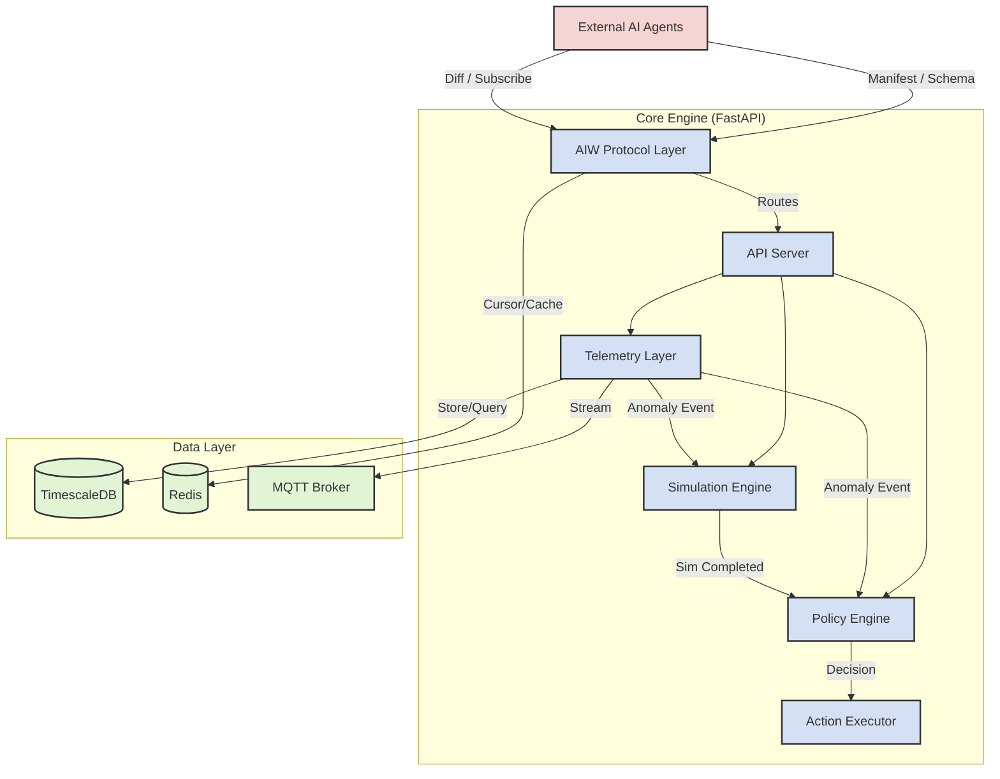
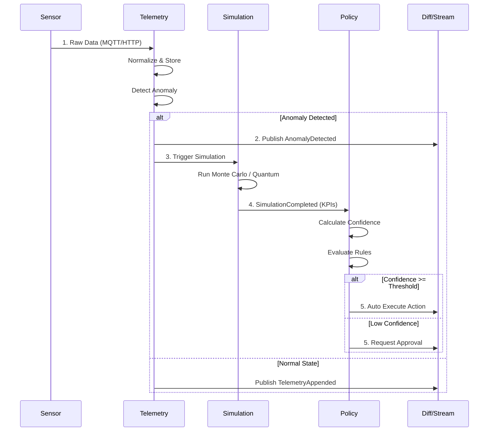

# OpsTwin Architecture

## System Overview

OpsTwin consists of 6 core layers, each with clear roles and responsibilities.



---

## Module Details

### 1. AIW Protocol Layer (`src/opstwin/aiw/`)

Handles communication with AI Agents.

| Component | File | Role |
| :--- | :--- | :--- |
| Manifest | `manifest.py` | Service Self-Description (Discovery) |
| DiffStream | `diff_stream.py` | Delta Sync, Cursor Management |
| SchemaRegistry | `schema_registry.py` | Schema Registration/Validation |
| SSEPublisher | `sse_publisher.py` | Real-time Event Publishing |

### 2. Telemetry Layer (`src/opstwin/telemetry/`)

Handles sensor data collection and processing.

| Component | File | Role |
| :--- | :--- | :--- |
| SensorAdapter | `sensor_adapter.py` | Sensor Connection (MQTT) |
| EventNormalizer | `event_normalizer.py` | Data Normalization |
| AnomalyDetector | `anomaly_detector.py` | Anomaly Detection (Z-Score) |
| TimeSeriesDB | `timeseries_db.py` | Time-series Storage |

### 3. Policy Engine (`src/opstwin/policy/`)

Manages automation rules and permissions.

| Component | File | Role |
| :--- | :--- | :--- |
| PermissionChecker | `permission_model.py` | RBAC Permission Check |
| ConfidenceScorer | `confidence_scorer.py` | Confidence Calculation |
| DecisionMaker | `decision_maker.py` | Decision Routing |
| ApprovalWorkflow | `approval_workflow.py` | Approval Workflow |

### 4. Simulation Engine (`src/opstwin/simulation/`)

Performs What-if analysis.

| Component | File | Role |
| :--- | :--- | :--- |
| MonteCarloEngine | `monte_carlo.py` | Monte Carlo Simulation |
| HybridCoupler | `hybrid_coupler.py` | Classical/Quantum Engine Selection |

---

## Data Flow (Event-Driven)



---

## Deployment Architecture

### Docker Compose Configuration

```yaml
services:
  opstwin:     # FastAPI Server (8000)
  redis:       # Cursor/Caching (6379)
  timescaledb: # Time-series DB (5432)
  kafka:       # Event Streaming (Optional)
```

### Scalability

- **Horizontal Scaling**: Multiple instances of FastAPI Server
- **Partitioning**: Sharding based on twin_id
- **Caching**: Caching simulation results with Redis

---

## Tech Stack

| Area | Technology |
| :--- | :--- |
| API | FastAPI 0.109+ |
| Database | TimescaleDB 2.x, Redis 7.x |
| Message Queue | Kafka 3.x (Optional) |
| Simulation | NumPy, Qiskit (Optional) |
| Testing | pytest 8.x |
| Container | Docker 24.x |

---

## Next Steps

- [Quick Start](../getting-started/quick-start.md)
- [API Reference](http://localhost:8000/docs)
- [Glossary](glossary.md)
