# What is OpsTwin?

## One-Line Definition

**OpsTwin** is an **Operational Optimization Platform** that performs **simulation-based decision making** on top of a real-time telemetry-based **Digital Twin** and executes automated actions according to **Policy**.

---

## 🎯 Problems Solved by OpsTwin

### Before OpsTwin: Human-Data Latency

```mermaid
graph LR
    Sensor[📡 Sensor Data] -->|Day~Week| Analyze[🧑‍💻 Human Analysis]
    Analyze -->|Meeting| Meeting[👥 Decision Meeting]
    Meeting -->|Approval| Approve[📝 Approval]
    Approve -->|Manual| Action[🔧 Field Action]
    
    style Analyze fill:#f9f,stroke:#333,stroke-width:2px
    style Meeting fill:#f9f,stroke:#333,stroke-width:2px
```



*Problem: Data is real-time, but decisions are delayed by human speed.*

### After OpsTwin: Real-time Automation

```mermaid
graph LR
    Sensor[📡 Sensor Data] -->|ms| AI[🧠 OpsTwin AI]
    AI -->|Simulation| Sim[🎲 Simulation]
    Sim -->|Confidence Score| Policy{⚖️ Policy Check}
    
    Policy -->|High Confidence| Auto[⚡ Auto Execute]
    Policy -->|Low Confidence| Human[👨‍🏫 Request Approval]
    
    style AI fill:#bbf,stroke:#333,stroke-width:2px
    style Sim fill:#bbf,stroke:#333,stroke-width:2px
    style Policy fill:#ffd,stroke:#333,stroke-width:4px
```



*Solution: Execute immediately if confidence is high, intervene only when low.*

---

## 💡 Core Values

| Value | Description |
| :--- | :--- |
| **Real-time Decision** | Automate Data → Analysis → Action without human intervention |
| **Simulation-based** | Pre-evaluate risks with "What-if" analysis |
| **Policy-Centric** | All automation is controlled by Policy |
| **AI-Friendly** | Easily integrate with AI Agents via AIW Protocol |
| **Traceable** | All decisions and changes are recorded in audit logs |

---

## 🏭 Use Cases

### Manufacturing (Smart Factory)

- Equipment anomaly detection → Auto-tune parameters
- Process condition simulation for yield optimization
- Predictive maintenance scheduling

### IT Infrastructure

- Server load anomaly → Auto-scaling
- Failure prediction → Preemptive resource reallocation
- Cost optimization simulation

### Energy / Utilities

- Power demand prediction → Generation adjustment
- Facility efficiency optimization
- Carbon emission monitoring

---

## 🔑 Key Concepts

### 1. Digital Twin

A software abstraction ("twin") of real systems/equipment.
Synchronized with real-time data to reflect current status.

### 2. AIW Protocol (AI Web)

A web protocol designed for easy consumption and synchronization by AI agents.

- **Manifest**: Service self-description
- **Schema**: Data structure definition
- **Diff/Stream**: Delta synchronization

### 3. Policy Engine

Defines the "law" of automation.

- **Permission (RBAC)**: Who can do what
- **Confidence**: How sure must we be to execute
- **Safety Constraints**: Limits that must never be crossed

### 4. Simulation

Predict results with pre-execution "What-if" analysis.
Calculate uncertainty using Monte Carlo simulation.

---

## 🚀 Quick Start

```bash
# 1. Install
pip install -e ".[dev]"

# 2. Run Server
uvicorn src.api.main:app --port 8000

# 3. Check Manifest
curl http://localhost:8000/.well-known/aiw-manifest.json
```

Detailed Guide: [Quick Start](../getting-started/quick-start.md)

---

## 📚 Next Steps

- [Architecture Overview](architecture.md)
- [Quick Start](../getting-started/quick-start.md)
- [Glossary](glossary.md)
