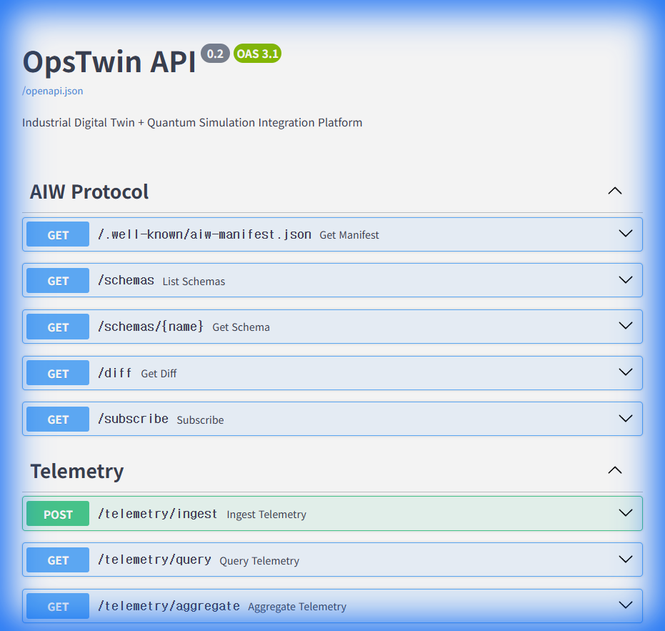

# OpsTwin Documentation

OpsTwin is an **Operational Optimization Platform** that automates **simulation-based decision making** on top of a real-time telemetry-based **Digital Twin**.

---

## 📚 Documentation Guide

### Getting Started

| Document | Description | Time to Read |
| :--- | :--- | :--- |
| [What is OpsTwin?](concepts/what-is-opstwin.md) | Why OpsTwin and what it solves | 5 min |
| [Quick Start](getting-started/quick-start.md) | Installation and first API call | 10 min |
| [Architecture Overview](concepts/architecture.md) | Understanding system structure | 15 min |

### Core Concepts

| Document | Description |
| :--- | :--- |
| [Glossary](concepts/glossary.md) | Definitions of terms like AIW, Twin, Policy |
| [Technical Spec v0.3](OpsTwin_aiw_Technical_Spec_v0.3.md) | Detailed technical specifications |

### Guides (Planned)

- Telemetry Guide
- Policy Guide
- Simulation Guide

### API Reference

Check Swagger UI after running the server:


```text
http://localhost:8000/docs
```

---

## 🏗️ Project Structure

```text
AI_Web/
├── src/
│   ├── opstwin/         # Core Business Logic
│   │   ├── aiw/         # AIW Protocol
│   │   ├── telemetry/   # Telemetry Layer
│   │   ├── policy/      # Policy Engine
│   │   └── simulation/  # Simulation Engine
│   └── api/             # FastAPI Server
├── tests/               # Tests (49 cases)
├── docker/              # Docker Configuration
└── docs/                # Documentation (Current Location)
```

---

## 🔗 Quick Links

- [GitHub Repository](https://github.com/sadpig70/AI_Web)
- [Swagger UI](http://localhost:8000/docs) (After Server Start)
- [README](../README.md)

---

## Internal Documents

Documents for internal development team reference are located in [internal/](internal/).

- [Gantree Design](internal/OpsTwin_Gantree.md)
- [MVP Implementation Plan](internal/OpsTwin_MVP_Implementation_Plan.md)
- [PPR Definition Plan](internal/OpsTwin_PPR_Definition_Plan.md)
- [PPR/Gantree Methodology](internal/PPR_Gantree_V4.md)
